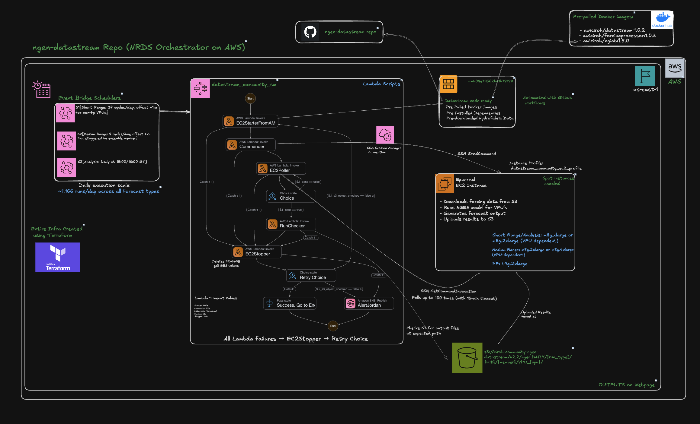

# NextGen Research DataStream
The NextGen Research DataStream is an array of daily [NextGen](https://github.com/NOAA-OWP/ngen)-based hydrolgic simulations in the AWS cloud. An exciting aspect of the Research DataStream is the NextGen configuration is [open-sourced](https://datastream.ciroh.org/) and [community editable](https://github.com/CIROH-UA/ngen-datastream/blob/main/docs/nrds/CONTRIBUTE.md), which allows any member of the hydrologic community to contribute to improving streamflow predictions. By making the NextGen forcings, outputs, and configuration publicly available, it is now possible to leverage regional expertise and incrementally improve streamflow predictions configured with the NextGen Framework.

## Architecture

  

Each daily execution is orchestrated through an AWS Step Functions state machine workflow. EventBridge triggers a scheduled event for each NWM forecast type (analysis assimilation, short range, medium range), which launches an EC2 instance from a pre-built AMI. The instance runs the DataStreamCLI to process forcings and execute NextGen, with polling and run-checking steps to confirm successful output delivery to S3.

## Status Dashboard
View the live operational status of all active datastream cycles:

**[NRDS Status Dashboard](https://ciroh-community-ngen-datastream.s3.amazonaws.com/status/dashboard.html)**

### Active Cycles
The Research DataStream currently operates the following forecast cycles across 18 VPU regions:

| Model | Forecast Types | Description |
|-------|---------------|-------------|
| **CFE_NOM** | Analysis Assimilation, Short Range, Medium Range | Conceptual Functional Equivalent model running across all 21 VPU regions |
| **LSTM** | Analysis Assimilation, Short Range, Medium Range | Long Short-Term Memory deep learning model |
| **ROUTING_ONLY** | Short Range | T-Route hydrodynamic routing |

Each cycle runs daily, processing CONUS-wide NWM forcings and producing NextGen streamflow outputs that are publicly available on S3.

## Datastream Viewer
Explore T-Route flow outputs interactively on a map:

**[Datastream Viewer](https://communityhydrofabric.s3.us-east-1.amazonaws.com/datastream_viewer.html?bucket=ciroh-community-ngen-datastream-temp&path=outputs%2F)**

## Documentation
* **Find daily output data at:** https://datastream.ciroh.org/index.html
* **Make improvements to NextGen configuration:**
Find out how you can contribute [here](https://github.com/CIROH-UA/ngen-datastream/blob/main/docs/nrds/CONTRIBUTE.md)!
* **Current status and configuration:** Read [here](https://github.com/CIROH-UA/ngen-datastream/blob/main/docs/nrds/STATUS_AND_METADATA.md)!
* **Infrastructure as Code:** See the NRDS AWS architecture [here](https://github.com/CIROH-UA/ngen-datastream/blob/main/infra/aws/terraform/docs/ARCHITECTURE.md).
* **Open Discussions**: Check out our discussions [here](https://github.com/CIROH-UA/ngen-datastream/discussions)! Feel free to start your own discussion, or participate in any that are ongoing.

# ForcingProcessor
ForcingProcessor has moved to https://github.com/CIROH-UA/forcingprocessor

# DataStreamCLI
DataStreamCLI has moved to https://github.com/CIROH-UA/datastreamcli

## License
The entirety of `ngen-datastream` is distributed under [GNU General Public License v3.0 or later](LICENSE.md)
