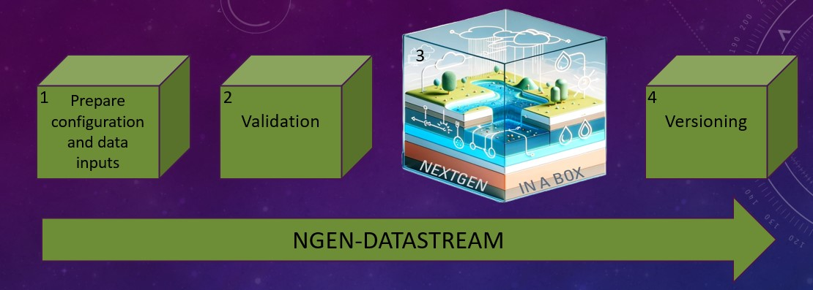

# NextGen Water Modeling Framework Datastream
`ngen-datastream` automates the process of collecting and formatting input data for NextGen, orchestrating the NextGen run through NextGen In a Box (NGIAB), and handling outputs. This software allows users to run NextGen in an efficient, _relatively_ painless, and reproducible fashion.



## Getting Started
* **Installation:** Follow the [Installation Guide](https://github.com/CIROH-UA/ngen-datastream/blob/main/INSTALL.md) to set up `ngen-datastream` on your system.
* **Docs**: Make sure to review the [documentation](https://github.com/CIROH-UA/ngen-datastream/blob/main/docs/) for
  * Available [NextGen models](https://github.com/CIROH-UA/ngen-datastream/blob/main/docs/NGEN_MODELS.md) and automated BMI configuration generation
  * [Datastream options](https://github.com/CIROH-UA/ngen-datastream/blob/main/docs/DATASTREAM_OPTIONS.md)
  * Input and output [directory structure](https://github.com/CIROH-UA/ngen-datastream/blob/main/docs/STANDARD_DIRECTORIES.md)
  * A [usage guide](https://github.com/CIROH-UA/ngen-datastream/blob/main/docs/USAGE.md) for executing `ngen-datastream` effectively 
  * A step-by-step [breakdown](https://github.com/CIROH-UA/ngen-datastream/blob/main/docs/BREAKDOWN.md) of `ngen-datastream`'s internal workflow
  * An explanation of the [Research DataStream](https://github.com/CIROH-UA/ngen-datastream/blob/main/research_datastream/README.md)

## Run it
This example will execute a 24 hour NextGen simulation over the Palisade, Colorado watershed with CFE, SLOTH, PET, NOM, and t-route configuration distributed over 4 processes. The forcings used are the National Water Model v3 Retrospective.

First, obtain a hydrofabric file for the gage you wish to model. Check out [hfsubset](https://github.com/lynker-spatial/hfsubsetCLI) for a handy cli tool for generating geopackages. For Palisade, Colorado:
```
hfsubset -w medium_range \
          -s nextgen \
          -v 2.1.1 \
          -l divides,flowlines,network,nexus,forcing-weights,flowpath-attributes,model-attributes \
          -o palisade.gpkg \
          -t hl "Gages-09106150"
```

Then feed the hydrofabric file to ngen-datastream along with a few cli args to define the time domain and NextGen configuration
```
./scripts/ngen-datastream -s 202006200100 \
                    -e 202006210000 \
                    -C NWM_RETRO_V3 \
                    -d $(pwd)/data/datastream_test \
                    -g $(pwd)/palisade.gpkg \
                    -R $(pwd)/configs/ngen/realization_sloth_nom_cfe_pet_troute.json \
                    -n 4
```

And that's it! Outputs will exist at `$(pwd)/data/datastream_test/ngen-run/outputs`

## License
`ngen-datastream` is distributed under [GNU General Public License v3.0 or later](LICENSE.md)
