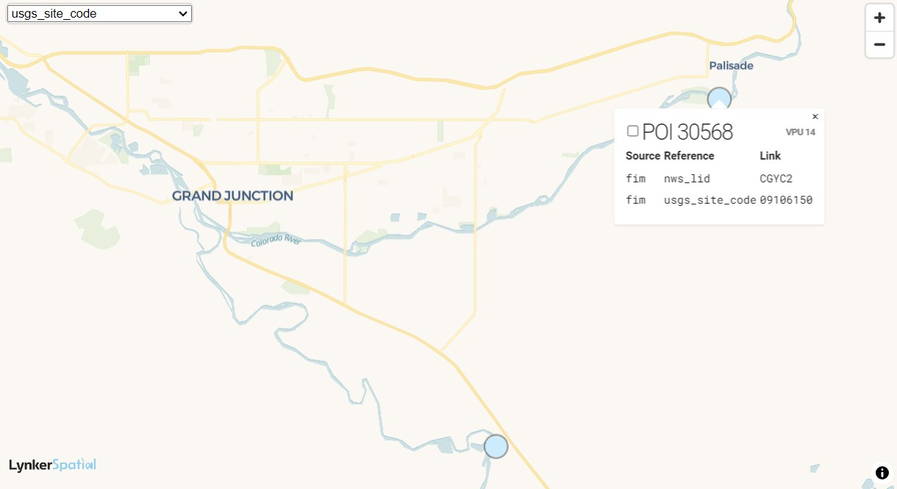

# `ngen-datastream` Breakdown
This document serves as a guide to run `ngen-datastream` step-by-step, which essentially walks the user through an example execution of `ngen-datastream/scripts/stream.sh`

## Use Case
Imagine we want to study the variation in NextGen configurations of retrospective streamflow forecasts for the Colorado River for the year 2019. We will use the steps below to prepare an input data package for NextGen, execute NextGen through NextGen in a Box, and then plot the results.

## Steps
* [Prepare Directories](#prepare-directories)
* [Spatial Domain](#spatial-domain)
* [Time Domain](#time-domain)
* [NextGen Configuration](#nextgen-configuration)
* [NextGen BMI Configuration File Generation](#nextgen-bmi-configuration-file-generation)
* [Validation](#validation)
* [NextGen Execution](#nextgen-execution)

Before proceeding, please review the [usage](https://github.com/CIROH-UA/ngen-datastream/blob/main/docs/USAGE.md) document and the [ngen-run](https://github.com/CIROH-UA/ngen-datastream/tree/main?tab=readme-ov-file#ngen-run) standard run directory portion of the repo's main [README](https://github.com/CIROH-UA/ngen-datastream/blob/main/README.md).

## Prepare Directories
As you've now read, NextGen in a Box requires a standard directory structure. In this step we prepare that directory and will write data to it in the following steps.

This guide will assume the user's current working directory is the `ngen-datastream` root folder.

To build `ngen-run/`
```
mkdir -p ./palisade_2019/ngen-run
mkdir ./palisade_2019/ngen-run/config
mkdir ./palisade_2019/ngen-run/forcings
mkdir ./palisade_2019/ngen-run/lakeout
mkdir ./palisade_2019/ngen-run/outputs
mkdir ./palisade_2019/ngen-run/restart
```

To hold intermediate files not directly required in NextGen in a Box execution
```
mkdir ./palisade_2019/datastream-metadata
```

## Spatial Domain
The spatial domain is defined via a geopackage file which is "cut" from the hydrofabric. Lynker-Spatial serves this spatial data via [hfsubset](https://github.com/lynker-spatial/hfsubsetCLI). An example command is provided below:

```
hfsubset \
    -w medium_range \
    -s nextgen \
    -v 2.1.1 \
    -l divides,flowlines,network,nexus,forcing-weights,flowpath-attributes,model-attributes \
    -o ./palisade_2019/ngen-run/config/palisade.gpkg \
    -t hl "Gages-09106150"
```
Some things to note about this command:
* `-l` : These layers are required: `divides`,`flowlines`,`network`,`nexus`,`forcing-weights`,`flowpath-attributes`, and`model-attributes`
* `-w` : Defines which grid the weights are calculated from. In this case, it's the medium_range forcing from the National Water Model
* `-v` : Defines the hydrofabric version
* The last arguement `"Gages-09106150"`, corresponds to the stream guage that hfsubset will use to trace the upstream network. This effectively defines the spatial domain. This is a guage on the Colorado River in Palisade, Colorado.

See [hfsubset](https://github.com/lynker-spatial/hfsubsetCLI) for more options.

Use the [Lynker Spatial Hydrolocation Viewer](https://www.lynker-spatial.com/hydrolocations.html) to find the guage (`usgs_site_code`) you want. 



Use the [NGIA geopackage viewer](https://ngageoint.github.io/geopackage-viewer-js/) to make sure you've got the spatial domain set properly.


[hfsubset](https://github.com/lynker-spatial/hfsubsetCLI) is integrated into `ngen-datastream`, which means the user can simply provide these three cli args to `stream.sh` to offload the [hfsubset](https://github.com/lynker-spatial/hfsubsetCLI) call to `ngen-datastream`
```
  -I, --SUBSET_ID           <Hydrofabric id to subset>  
  -i, --SUBSET_ID_TYPE      <Hydrofabric id type>  
  -v, --HYDROFABRIC_VERSION <Hydrofabric version>
  ```

## Time Domain
Defining the time over which the simulation will run is essentially captured in the forcings (precipitation, wind speed, etc.). There are many sources of forcings that can be used in NextGen. While it is certainly possible to use forcings from a variety of sources (NWM, AORC, etc.) `ngen-datastream` integrates [nwmurl](https://github.com/CIROH-UA/nwmurl), which will provide National Water Model forcings filenames based on the time period the user provides. To generate these forcings independently, follow the steps below:

First, we use [nwmurl](https://github.com/CIROH-UA/nwmurl) to generate a list of nwm forcing filenames that [forcingprocessor](https://github.com/CIROH-UA/ngen-datastream/tree/main/forcingprocessor) reads from. We define exactly which forcings files we want with the options in conf_nwmurl.json. 

There are two types of this conf_nwmurl.json. One for operational forcings which looks like this:
```
{
    "forcing_type" : "operational_archive",
    "start_date"   : "",
    "end_date"     : "",
    "fcst_cycle"   : [0],
    "lead_time"    : [],
    "varinput"     : 5,
    "geoinput"     : 1,
    "runinput"     : 2,    
    "urlbaseinput" : 7,
    "meminput"     : 0
}
```
One for retrospective forcings which looks like this:
```
{
    "forcing_type" : "retrospective",
    "start_date"   : "",
    "end_date"     : "",
    "urlbaseinput" : 4,
    "selected_object_type" : [1],
    "selected_var_types"   : [6],
    "write_to_file" : true
}
```
See [nwmurl](https://github.com/CIROH-UA/nwmurl) for an in-depth explaination of the options.

Now let's generate the 2019 retrospective forcings. Let's make our own conf_nwmurl.json:
```
{
    "forcing_type" : "retrospective",
    "start_date"   : "201901010100",
    "end_date"     : "201912312300",
    "urlbaseinput" : 4,
    "selected_object_type" : [1],
    "selected_var_types"   : [6],
    "write_to_file" : true
}
```
Save this file to `./palisade_2019/datastream-metadata/conf_nwmurl_retro.json`

Here's an example command to generate the list of forcing filenames with this configuration:
```
python ./forcingprocessor/src/forcingprocessor/nwm_filenames_generator.py ./palisade_2019/datastream-metadata/conf_nwmurl_retro.json
```
This should write out a file named `retro_filenamelist.txt`. List the first and last few lines to make sure we have the forcings we want.
```
head -n 20 ./retro_filenamelists.txt
```
```
tail -n 20 ./retro_filenamelist.txt
```

Save this file as `./palisade_2019/datastream-metadata/retro_filenamelist.txt`

Now that we have the forcing filenames in a text file, we can set up `forcingprocessor` by creating our own `conf_fp.json`. See [here](https://github.com/CIROH-UA/ngen-datastream/tree/main/forcingprocessor#confjson-options) for a deeper explanation of the options.
```
{
    "forcing"  : {
        "nwm_file"   : "./palisade_2019/datastream-metadata/retro_filenamelist.txt",
        "gpkg_file"  : ["./palisade_2019/ngen-run/config/palisade.gpkg"]
    },

    "storage":{
        "storage_type"      : "local",
        "output_path"       : "./palisade_2019/ngen-run/forcings",
        "output_file_type" : ["csv"]
    },    

    "run" : {
        "verbose"       : true,
        "collect_stats" : true,
        "nprocs"        : 8
    }
}
```
Save this file as `./palisade_2019/datastream-metadata/conf_fp.json`

Execute `forcingprocessor` with the following command
```
python ./forcingprocessor/src/forcingprocessor/processor.py ./palisade_2019/datastream-metadata/conf_fp.json
```
This should write out NextGen forcings csv files to `./palisade_2019/ngen-run/forcings`

## NextGen Configuration
NextGen configuration is determined by the realization file. See the [NextGen repo](https://github.com/NOAA-OWP/ngen/wiki/Realization-Config) for documentation on building this file. Create and save it to `./palisade_2019/ngen-run/config/realization.json`. There are template realizations located in `ngen-datastream` at  `./configs/ngen`.

## NextGen BMI Configuration File Generation
Each model defined in the realization file will require the creation of configuration files, often for each catchment defined in the geopackage. `ngen_configs_gen.py` will generate all of the required BMI configuration files based on which models are found in the realization file. See [this document](https://github.com/CIROH-UA/ngen-datastream/blob/main/docs/NGEN_MODULES.md) for which models are currently integrated into `ngen-datastream`. If you define a model in the realization file that is not integrated, you will need to manually create the necessary BMI configuration files.

If Noah-OWP-Modular is defined in the realization file, compute the noah-owp pickle file. This is admittedly hacky and will be depreciated soon.
```
python ./python/src/datastream/noahowp_pkl.py \
    --hf_file ./palisade_2019/ngen-run/config/palisade.gpkg \
    --outdir ./palisade_2019/datastream-metadata
```

To generate the NextGen BMI configuration models:
```
python ./python/src/datastream/ngen_configs_gen.py \
    --hf_file ./palisade_2019/ngen-run/config/palisade.gpkg \
    --outdir ./palisade_2019/ngen-run/config \
    --pkl_file ./palisade_2019/datastream-metadata/noah-owp-modular-init.namelist.input.pkl \
    --realization ./palisade_2019/ngen-run/config/realization.json
    --ignore ""
```

Inspect `./palisade_2019/ngen-run/config` to see what BMI model configuration files were created.

## Validation
We have now completed the required steps to generate the input data package for a NextGen simulation. As you can tell by now, there are many steps and thus many places to make a mistake. The `run-validator.py` script provides a quick way to check that the input data package contains the required files and that they are consistent to one another. See [here](https://github.com/CIROH-UA/ngen-datastream/tree/main/python#run_validatorpy) for an explanation of the validation. 

Execute the validator on the `ngen-run` package we have created.
```
python ./python/src/datastream/run_validator.py --data_dir ./palisade_2019/ngen-run 
```

If the run package is valid, it will complete without error. If you find the error messaging not clearly communicating the fault with the input package, start an issue in the repo to have the messaging improved.

Proceed only when the input package passes validation.

## NextGen Execution
Let's do this thing! Feed the input data package to NextGen in a Box with auto mode.

```
docker run --rm -v $(pwd)/palisade_2019/ngen-run:/ngen-run awiciroh/ciroh-ngen-image:latest /ngen-run auto 8
```
In this command we mount the `./palisade_2019/ngen-run` directory to the docker container and execute on `/ngen-run` with 8 processes. When the execution completes, output data should be located in `/palisade_2019/ngen-run/outputs/`.


