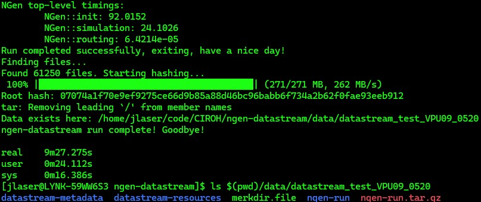
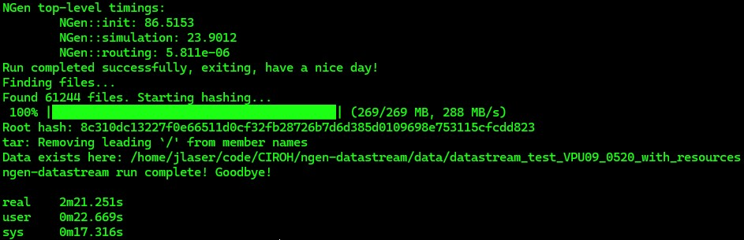
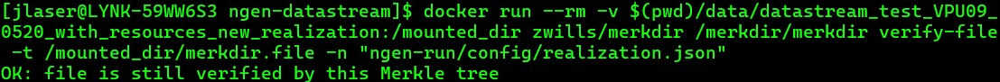

# Welcome to the NextGen Simulation Development Tools Workshop!

A few quick notes before beginning
* Each command assumes the user's working directory is the `ngen-datastream` top folder
* `ngen-datastream` will not overwrite a `DATA_DIR`. If you attempt to write to an already existing path, a message will alert you to either delete it, or set a different `DATA_DIR` with `-d`.
* The commands in this workshop set the number of processes to 4. Feel free to use more if you have more cores, though increasing `-n` may contribute to network bottle neck if processing locally. Most commands with a resource directory won't suffer from network bottleneck. 

## Start
1) Install `ngen-datastream` by following [INSTALL.md](https://github.com/JordanLaserGit/ngen-datastream/blob/main/INSTALL.md)

2) Now we can issue `ngen-datastream` commands. First, we will issue the command available in the repository's main [README.md](https://github.com/CIROH-UA/ngen-datastream?tab=readme-ov-file#run-it). If you downloaded files prior to the workshop, replace the argument URLs in the commands below with local paths.

   This command will execute a 24 hour NextGen simulation over VPU 09 (11,000 catchments) with CFE, SLOTH, PET, and NOM configuration distributed over 4 processes. The `time` command has been placed in front of `stream.sh` so that we will get the runtime following execution.
   ```
   time ./scripts/stream.sh \
    -s 202405200100 \
    -e 202405210000 \
    -d $(pwd)/data/datastream_test_VPU09_0520 \
    -g https://lynker-spatial.s3.amazonaws.com/hydrofabric/v20.1/gpkg/nextgen_09.gpkg \
    -G https://lynker-spatial.s3.amazonaws.com/hydrofabric/v20.1/model_attributes/nextgen_09.parquet \
    -R $(pwd)/configs/ngen/realization_cfe_sloth_pet_nom.json \
    -n 4
    ```
    Use `-f` option to point to the directory of nwm-forcings if you have them saved locally.
  

    Once the command has completed, look into `$(pwd)/data/datastream_test_VPU09_0520` and investigate the directory that was created. For an explaination of this directory, see [here](https://github.com/CIROH-UA/ngen-datastream/blob/main/README.md#ngen-datastream-output-directory-structure).

    ```
    ls $(pwd)/data/datastream_test_VPU09_0520
    ```

    


    Make note of how long this run took. We will compare this runtime with the duration of the following runs.

## Executing with the Resource Directory
3) Next, we will perform the identical simulation, but we will provide `ngen-datastream` with the resource directory that was just created. See [here](https://github.com/CIROH-UA/ngen-datastream/tree/main?tab=readme-ov-file#resource_dir-datastream-resources) for an explanation of the resource directory. Note that we no longer need to provide paths to the hydrofabric or NextGen realization file. `ngen-datastream` will find them in the resource directory. Also, we will write to a different `DATA_DIR`. 

    To do this, we will copy the resource directory that was just created at `$(pwd)/data/datastream_test_VPU09_0520/datastream-resources`

    ```
    cp -r $(pwd)/data/datastream_test_VPU09_0520/datastream-resources $(pwd)/data/resources_VPU09_0520
    ```

   ```
   time ./scripts/stream.sh \
    -s 202405200100 \
    -e 202405210000 \
    -d $(pwd)/data/datastream_test_VPU09_0520_with_resources \
    -r $(pwd)/data/resources_VPU09_0520 \
    -n 4
    ```
    

    Take note of the speed-up from the execution in step 2. In this case, `ngen-datastream` was provided just about everything it needs to run NextGen, so nearly all of the runtime is NextGen compute time. 

    Researchers will often repeat simulations with small differences in model configuration. `ngen-datastream` allows users to efficiently repeat executions, which differ only in NextGen configuration. 

4) To repeat the above simulation with a differing NextGen configuration, remove the realization file from the resource directory.

    ```
    rm $(pwd)/data/resources_VPU09_0520/config/realization_cfe_sloth_pet_nom.json
    ```

    The below command will point to the same realization as in step 2, but it is possible to supply any valid NextGen realization file. Note that if the BMI modules defined in the user supplied realization file do not correspond to the configs in `ngen-bmi-configs.tar.gz` in `$(pwd)/data/resources_09/config`, validation will fail. Remove `ngen-bmi-configs.tar.gz` from the resources and `ngen-datastream` will generate the proper config files for the current realization.

    ```
    time ./scripts/stream.sh \
        -s 202405200100 \
        -e 202405210000 \
        -d $(pwd)/data/datastream_test_VPU09_0520_with_resources_new_realization \
        -r $(pwd)/data/resources_VPU09_0520 \
        -R $(pwd)/configs/ngen/realization_cfe_sloth_pet_nom.json \
        -n 4
    ```

5) Next, imagine we have arrived at a "better" NextGen configuration by iterating over many NextGen simulations. We now want to apply that configuration to a different day over the same spatial domain. If we want to continue to use our resources, we can create a new resource directory without the ngen-forcings tarball. The files contained in `forcings.tar.gz` are time dependent and will not match the new simulation time.

    ```
    cp -r $(pwd)/data/resources_VPU09_0520 $(pwd)/data/resources_VPU09    
    rm -rf $(pwd)/data/resources_VPU09/ngen-forcings
    ```

    Now our resource directory contains only the time-independent files. 
    
    Make sure to copy a valid realization file into the `config` subfolder in the resource directory. Feel free to try your own!
    ```
    cp $(pwd)/configs/ngen/realization_cfe_sloth_pet_nom.json  $(pwd)/data/resources_VPU09/config
    ```
    
    We now process over the next day (0521)
    
    ```
    time ./scripts/stream.sh \
    -s 202405210100 \
    -e 202405220000 \
    -d $(pwd)/data/datastream_test_VPU09_0521_with_resources_new_realization \
    -r $(pwd)/data/resources_VPU09 \
    -n 4
    ```

    Now we can do some real science! This functionality allows for efficient and reproducible NextGen simulations that can then be evaluated. See the TEEHR workshop tomorrow at 1:30 in room 6619 (same room)! 

## Validation
6) Let's image we were very excited about our next NextGen configuration and hastily issued the command without having removed the ngen forcings from the resource directory. In other words, let's see what happens when we change the simulation time arguments, while supplying `ngen-datastream` with ngen-forcings for a different time period.

    Note that this command points to the 0520 execution's resource directory, but modifies the time.

    ```
    time ./scripts/stream.sh \
    -s 202405210100 \
    -e 202405220000 \
    -d $(pwd)/data/datastream_test_validation_fail \
    -r $(pwd)/data/datastream_test_VPU09_0520_with_resources_new_realization/datastream-resources \
    -n 4
    ```

    Examine the error you see. It should explain the nature of the problem.

7) As mentioned previously, `ngen-datastream` will validate all relevant NextGen BMI module configuration files required by the supplied realization file. 

    Let's call the validator on a `ngen-run` package we know has already passed validation.

    x86 based platforms:
    ```
    docker run --rm -v $(pwd)/data/datastream_test_VPU09_0520_with_resources_new_realization/ngen-run:/mounted_dir \
    awiciroh/datastream:latest-x86 python /ngen-datastream/python/src/datastream/run_validator.py \
    --data_dir /mounted_dir
    ```

    arm based platforms
    ```
    docker run --rm -v $(pwd)/data/datastream_test_VPU09_0520_with_resources_new_realization/ngen-run:/mounted_dir \
    awiciroh/datastream:latest python /ngen-datastream/python/src/datastream/run_validator.py \
    --data_dir /mounted_dir
    ```

    Let's deliberately "forget" to include one of the many configuration files by moving it outside of the `ngen-run` directory.

    ```
    mv $(pwd)/data/datastream_test_VPU09_0520_with_resources_new_realization/ngen-run/config/CFE_cat-1487334.ini $(pwd)/data/
    ```

    Repeat the validator command. The validator should have identified the missing file.

## Versioning
8) `merkdir` allows us to prove that a NextGen configuration (realization), or any other file, was a component in an ngen-datastream execution. 

```
docker run --rm -v $(pwd)/data/datastream_test_VPU09_
0520_with_resources_new_realization:/mounted_dir zwills/merkdir /merkdir/merkdir verify-file -t /mounted_dir/merkdir.file -n "ngen-run/config/realization.json"
```




That's all folks! Thanks for attending and please don't hesitate to reach out to any of the development team with questions. Submit bugs to the repository if found!

Jordan Laser
jlaser@lynker.com


