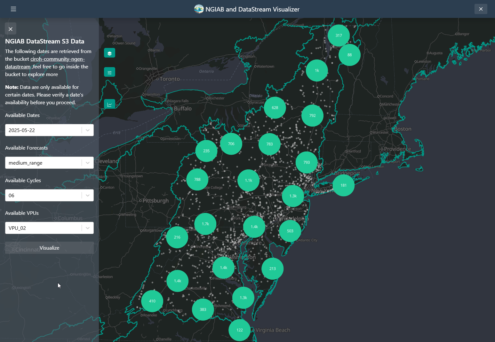
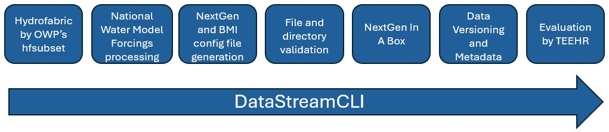

# Welcome to the NextGen Research DataStream: How to Contribute to Improving NextGen Forecasts Workshop!

In this workshop, we will gain an understanding of
1) Research DataStream 
2) DataStreamCLI workflows
3) DataStreamCLI tooling and ForcingProcessor


During this tutorial, please submit at least 1 question. [Link to Slido](https://app.sli.do/event/aPwiSLathJxNd1NknEdKkE).

---

Tutorial Index

1) Research DataStream
    <ol type="a">
    <li>Home Page</li>
    <li>Forcings</li>
    <li>NextGen Outputs</li>
    <li>Tethys Visualizer</li>
    <li>How To Contribute Your NextGen Model Parameters</li>
    </ol>
2) DataStreamCLI workflow tutorial
    <ol type="a">     
    <li>From Scratch</li>
    <li>From Resource Directory</li>    
    </ol>

3) DataStreamCLI individual tools tutorial
    <ol type="a">         
    <li>ForcingProcessor</li>   
    <li>Validation</li>
    <li>BMI config files</li>
    </ol>

---
## 1) Inspecting Research DataStream
### i) Home Page

 Check out the [home page](https://datastream.ciroh.org/index.html) of the Research DataStream. We will look around and gain familiarity with what is available. A driving principle of this project is to make as much of this system transparent as possible, so there is a lot to find here.

On the home page, we find the following directory structure. Object storage technically isn't a file system, but discussing in this fashion makes representing the locations of files easier.
```
├── parameters/			
├── realizations/			
├── state/			
├── v2.1/			
├── v2.2/			
```

Let's go folder by folder.
 
```
├── parameters/	
```
The `parameters` folder contains parquet files that correspond to a VPU. These files hold community proposed NextGen model parameters. Once parameters have been accepted into the "official" parameter set, these values are written into the NextGen `realizations` that are ingested dynamically on every Research DataStream execution. This means that as soon as parameters are accepted, all following output data will be generated using these parameters.
[Example file for VPU 16](https://ciroh-community-ngen-datastream.s3.amazonaws.com/parameters/parameters_16.parquet).
<br/><br/>
```
├── realizations/	
```
The `realizations` folder holds the current "official" NextGen configuration files. These files are responsible for specifying the catchment-level model selection and parameter values. [Example file for VPU 16](https://ciroh-community-ngen-datastream.s3.amazonaws.com/realizations/realization_VPU_16.json).
<br/><br/>
```
├── state/	
```
The `state` folder holds the current build of the AWS infrastructure. Unless you are interested in the design of the Research DataStream infrastructure itself, the contents of this folder are not of interest. If you are interested, see [these docs](https://github.com/CIROH-UA/ngen-datastream/blob/main/research_datastream/terraform/ARCHITECTURE.md) to clarify the build.
<br/><br/>
```
├── v2.1/			
├── v2.2/	
```
These folders contain the NextGen inputs and outputs that make up the Research DataStream. The version numbers correspond to hydrofabric versions. At the time of DevCon2025, the Research DataStream is running on v2.2 hydrofabric, but will stay current as new hydrofabric versions are released. Stay up to date on the [status of the Research DataStream](https://github.com/CIROH-UA/ngen-datastream/blob/main/research_datastream/STATUS_AND_METADATA.md).
<br/><br/>

Let's take a look at example data generated using the v2.2 hydrofabric.

---
### ii) Forcings

Example short_range forcings init cycle 04 
```
├── v2.2/	
    ├── ...
    ├── ngen.20250513/
        ├── ... 
        ├── forcing_short_range
            ├── ... 
            ├── 04
                ├── ...
                ├── ngen.t04z.short_range.forcing.f001_f018.VPU_09.nc

```

or

https://ciroh-community-ngen-datastream.s3.amazonaws.com/v2.2/ngen.20250513/forcing_short_range/04/ngen.t04z.short_range.forcing.f001_f018.VPU_09.nc

This forcings URL takes the form of 

`DATASTREAM_HOME_URL` / `HF_VERSION` / ngen.`DATE_YYYYMMDD` /forcing_`RUN_TYPE` / `INIT_CYCLE` / ngen.t`INIT_CYCLE`z.`RUN_TYPE`.forcing.f001_f018.VPU_`VPU`.nc


Each netcdf holds 18 hours of catchment-averaged (non-gridded) National Water Model forcings created by [forcingprocessor](https://github.com/CIROH-UA/ngen-datastream/blob/main/forcingprocessor/README.md). This data is ingested in the NextGen executions.

---
### iii) NextGen Outputs

Example short_range NextGen outputs for init cycle 04 
```
├── v2.2/	
    ├── ...
    ├── ngen.20250513/
        ├── ... 
        ├── short_range
            ├── ... 
            ├── 04
                ├── ...
                ├── VPU_09
                    ├── ...
                    ├── ngen-run.tar.gz

```

Example short_range NextGen outputs init cycle 04, vpu 09 

https://ciroh-community-ngen-datastream.s3.amazonaws.com/v2.2/ngen.20250513/short_range/04/VPU_09/ngen-run.tar.gz

This NextGen output file URL takes the form of 

`DATASTREAM_HOME_URL` / `HF_VERSION` / ngen.`DATE_YYYYMMDD` /`RUN_TYPE` / `INIT_CYCLE` / `VPU` / ngen-run.tar.gz

The directory structure follows the standard [here](https://github.com/CIROH-UA/ngen-datastream/blob/main/docs/STANDARD_DIRECTORIES.md), with the only differences being 

1) the `ngen-run` folder is available as a tarball
2) `datastream-resources` is missing, but available in the datastream resources bucket https://datastream-resources.s3.us-east-1.amazonaws.com/VPU_09/config/nextgen_VPU_09.gpkg
3) The AWS execution json is available, which provides the DataStreamCLI command and other execution details https://ciroh-community-ngen-datastream.s3.amazonaws.com/v2.2/ngen.20250513/short_range/04/VPU_09/datastream-metadata/execution.json . For more on the execution file, see the [Research DataStream docs](https://github.com/CIROH-UA/ngen-datastream/blob/main/research_datastream/terraform/GETTING_STARTED.md#3-configure-execution-file).

### iv) [Tethys Visualizer](https://github.com/CIROH-UA/ngiab-client)



The [Visualizer](https://github.com/CIROH-UA/ngiab-client) allows the user to download data as well from an [S3 bucket](https://datastream.ciroh.org/index.html) containing the output of the [NextGen DataStream](https://github.com/CIROH-UA/ngen-datastream). The Visualizer contains the [`ViewOnTethys.sh`](https://github.com/CIROH-UA/ngiab-client/blob/main/viewOnTethys.sh) script that is similar to the `ViewOnTethys.sh` found at the [NGIAB-CloudInfra](https://github.com/CIROH-UA/NGIAB-CloudInfra). The `ViewOnTethys.sh` will create a `~/.datastream_ngiab` directory in which it saves all the different outputs downloaded by the visualizer. It will also create a `~/.datastream_ngiab/datastream_ngiab.json` in which metadata will be saved to locate the downloaded output directories. It serves as a cache, so it allows the user to look first at the `~/.datastream_ngiab` before trying to download the data

```bash
ℹ Reclaiming ownership of /home/aquagio/.datastream_ngiab  (sudo may prompt)…
  ℹ No existing Datastream cache found – a fresh download will be used.
```

The `.datastream_ngiab.json` appends the different downloads with metadata that allows the user to know the file being downloaded. The `prefix` belongs to the path on the s3 bucket. The `label` is created with the following format: `ngen.<date>_<forecast_type>_<cycle>_<VPU>`

```json
{
    "datastream": [
        {
            "label": "ngen.20250522_medium_range_06_VPU_02",
            "bucket": "ciroh-community-ngen-datastream",
            "prefix": "v2.2/ngen.20250522/medium_range/06/VPU_02/ngen-run.tar.gz",
            "path": "/var/lib/tethys_persist/.datastream_ngiab/ngen.20250522_medium_range_06_VPU_02",
            "date": "2021-01-01:00:00:00",
            "id": "15145d327f19426b890e4465160f963a"
        }
    ]
}
```

> **_NOTE:_** assuming only the first ensemble. If we are specific it will look like this: `ngen.<date>_<forecast_type>_<cycle>_<ensemble>_<VPU>`

This functionality allows the user to be able to quickly search the data they want from the [S3 bucket](https://datastream.ciroh.org/index.html) containing the output of the [NextGen DataStream](https://github.com/CIROH-UA/ngen-datastream). They can explore and download as needed.


If the user wants more control 🎮 and just define the env variables and run the container.


```bash
# Set environment variables
export TETHYS_CONTAINER_NAME="tethys-ngen-portal"        \
       TETHYS_REPO="awiciroh/tethys-ngiab"               \
       TETHYS_TAG="latest"                               \
       NGINX_PORT=80                                     \
       MODELS_RUNS_DIRECTORY="$HOME/ngiab_visualizer"    \
       DATASTREAM_DIRECTORY="$HOME/.datastream_ngiab"    \
       VISUALIZER_CONF="$MODELS_RUNS_DIRECTORY/ngiab_visualizer.json" \
       TETHYS_PERSIST_PATH="/var/lib/tethys_persist"     \
       SKIP_DB_SETUP=false                               \
       CSRF_TRUSTED_ORIGINS="[\"http://localhost:${NGINX_PORT}\",\"http://127.0.0.1:${NGINX_PORT}\"]"
```
> **_NOTE:_** The user might need to create the files/directories associated to the env variables.

🕹️ Run container

```bash
docker run --rm -d \
  -v "$MODELS_RUNS_DIRECTORY:$TETHYS_PERSIST_PATH/ngiab_visualizer" \
  -v "$DATASTREAM_DIRECTORY:$TETHYS_PERSIST_PATH/.datastream_ngiab" \
  -p "$NGINX_PORT:$NGINX_PORT" \
  --name "$TETHYS_CONTAINER_NAME" \
  -e MEDIA_ROOT="$TETHYS_PERSIST_PATH/media" \
  -e MEDIA_URL="/media/" \
  -e SKIP_DB_SETUP="$SKIP_DB_SETUP" \
  -e DATASTREAM_CONF="$TETHYS_PERSIST_PATH/.datastream_ngiab" \
  -e VISUALIZER_CONF="$TETHYS_PERSIST_PATH/ngiab_visualizer/ngiab_visualizer.json" \
  -e NGINX_PORT="$NGINX_PORT" \
  -e CSRF_TRUSTED_ORIGINS="$CSRF_TRUSTED_ORIGINS" \
  "${TETHYS_REPO}:${TETHYS_TAG}"
```

If you want a more detailed explanation 👉 Look at the visualizer [source code](https://github.com/CIROH-UA/ngiab-client)

### v) How To Contribute Your NextGen Model Parameters
Lynker and the Alabama Water Institute have developed tooling to implement CIROH community proposed NextGen model parameters in the Research DataStream. This feature enacts the goal of CIROH to 

>"collaboratively research, develop and deliver state-of-the science, national hydrologic analyses, forecast information, data, guidance, and equitable decision-support services to inform essential emergency management and water resources decisions across all time scales" 

by opening a national-scale water modeling system to be continually improved upon by the community. 

In the future, we plan to establish a standard interface and workflow by which CIROH community members may submit their parameters to be used in Research DataStream executions. We plan for this workflow to both validate the contents of the submission against a standard and evaluate the predictive performance of the system using the proposed parameters.

This workflow will require that the user provide at least the minimum information:

* A geopackage which provides the hydrofabric version and catchment id's
* A NextGen realization file that contains the model parameters

Once the changes are accepted, the changes will exist publicly as NextGen realizations files [here](https://datastream.ciroh.org/index.html#realizations/).

If you would like to propose your parameters before this workflow is made publicly available, please reach out to James Halgren at jshalgren@ua.edu.

---

## 2. DataStreamCLI Workflow Tutorial
The software that manages the workflow and compute to generate these output data are publicly available in the repository and is referred to collectively as `DataStreamCLI`. In this section, we will walk through this on-server workflow behind the Research DataStream to gain an understanding of the use case for the underlying tooling and how it may apply to your own research tasks.

DataStreamCLI is a standalone tool that automates the preprocessing input data for NextGen, executing the run through NextGen In a Box (NGIAB), and handling outputs. This software implements [standard directories](https://github.com/CIROH-UA/ngen-datastream/blob/main/docs/STANDARD_DIRECTORIES.md) that allow users to run NextGen in an efficient, relatively painless, and reproducible fashion while providing flexibility and integrations like hfsubset, NextGen In A Box, TEEHR, and the Tethys Visualizer.



This one tool (available as a shell script [here](https://github.com/CIROH-UA/ngen-datastream/blob/main/scripts/datastream)) will compute every necessary step in the workflow. If this is your first time interacting with DataStreamCLI, the [guide](https://github.com/CIROH-UA/ngen-datastream/blob/main/scripts/datastream_guide) is a great place to start. In addition, a [breakdown document](https://github.com/CIROH-UA/ngen-datastream/blob/main/docs/BREAKDOWN.md) is available which walks through manually performing each of the steps that DataStreamCLI automates. The [AGU 2024 Poster](https://github.com/CIROH-UA/ngen-datastream/blob/main/docs/AGU2024.jpg) is available for a compact reference on both the Research DataStream and DataStreamCLI.

---

### i) DataStreamCLI From Scratch
If you haven't cloned the repository already

```
git clone https://github.com/CIROH-UA/ngen-datastream.git
```

```
cd ngen-datastream
```

If you are executing on ARM architecture, set the following environment variables
```
export DS_TAG=latest
export FP_TAG=latest
```

The example command below will, from scratch, perform the exact NextGen simulation as today's 0600 UTC short_range cycle. Try this command.
```
./scripts/datastream \
--NPROCS 8 \
--START_DATE DAILY \
--FORCING_SOURCE NWM_V3_SHORT_RANGE_06 \
--DATA_DIR ./outputs \
--REALIZATION https://ciroh-community-ngen-datastream.s3.us-east-1.amazonaws.com/realizations/realization_VPU_09.json \
--GEOPACKAGE https://datastream-resources.s3.us-east-1.amazonaws.com/VPU_09/config/nextgen_VPU_09.gpkg
```
In this command, we specify 
* the date with `--START_DATE DAILY`
* the time range and the gridded forcing source with `--FORCING_SOURCE NWM_V3_SHORT_RANGE_06`. The string format is "NWM_V3_<RUN_TYPE_>_<INIT_CYCLE>"
* the local disk location to write the data to with `--DATA_DIR ./outputs`
* the realization file to configure NextGen with `--REALIZATION https://ciroh-community-ngen-datastream.s3.us-east-1.amazonaws.com/realizations/realization_VPU_09.json `
* the geopackage, which defines the spatial domain with `--GEOPACKAGE https://datastream-resources.s3.us-east-1.amazonaws.com/VPU_09/config/nextgen_VPU_09.gpkg`

This command is equivalent to the daily short range execution for the Research DataStream.

---

### ii) DataStreamCLI With Resources
Considering the Research DataStream must execute hundreds of simulations every day, DataStreamCLI can read from a cache directory referred to as a resource directory. This avoids wasteful repetitive calculations. These files are stored in `datastream-resources`, which is documented [here](https://github.com/CIROH-UA/ngen-datastream/blob/main/docs/STANDARD_DIRECTORIES.md#resource_dir-datastream-resources). 

Use the resources generated in the previous DataStreamCLI execution in another.

```
cp -r ./outputs/datastream-resources .
```
Repeat the command with the addition of `-r` to point to our resource directory. Note that the realization and geopackage arguments are no longer needed, as DataStreamCLI will find them within the resource directory. We will write to `outputs_with_resources`

```
./scripts/datastream \
--NPROCS 8 \
--START_DATE DAILY \
--FORCING_SOURCE NWM_V3_SHORT_RANGE_06 \
--DATA_DIR ./outputs_with_resources \
--RESOURCE_DIR ./datastream-resources
```
Compared with the previous execution, this should take less time as the NextGen forcings and BMI config files were read directly and not computed. If desired, remove any files from the resource directory and DataStreamCLI dynamically will create them based on the input arguments (i.e. for a simulation over the same domain, but a different time period, you can reuse the resource directory but remember to delete the forcings).

---

## 3). DataStreamCLI Individual Tools
The DataStreamCLI workflow is modular such that the Docker containers responsible for each step can be used in isolation. In this section, we will use the tools directly. 

### i) `ForcingProcessor` 


`ForcingProcessor` converts hourly National Water Model gridded NetCDF forcings files into a NextGen compatible catchment-averaged NetCDF file. For more information on this tool, see the [README](https://github.com/CIROH-UA/ngen-datastream/blob/main/forcingprocessor/README.md) and [forcing source documentation](https://github.com/CIROH-UA/ngen-datastream/blob/main/forcingprocessor/FORCING_SOURCES.md).

DataStreamCLI generates the two configuration files necessary to drive ForcingProcessor. 

Using the `datastream-metadata` folder generated previously at `ngen-datastream/outputs/datastream-metadata`,

1) `conf_fp.json`

The primary configuration file. See the [README](https://github.com/CIROH-UA/ngen-datastream/blob/main/forcingprocessor/README.md) for an explanation of this file. Note that the paths are relative to `/mounted_dir` which is associated with `/home/exouser/ngen-datastream/outputs` in the Docker command.
```
{
  "forcing": {
    "nwm_file": "/mounted_dir/datastream-metadata/filenamelist.txt",
    "gpkg_file": [
      "/mounted_dir/datastream-resources/config/nextgen_VPU_09.gpkg"
    ]
  },
  "storage": {
    "output_path": "/mounted_dir/ngen-run",
    "output_file_type": [
      "netcdf"
    ]
  },
  "run": {
    "verbose": true,
    "collect_stats": true,
    "nprocs": 4
  }
}
```
>Note that the file paths are relative to the mounted directory

2) `filenamelist.txt`

which will specify the NWM files to be processed
```
https://noaa-nwm-pds.s3.amazonaws.com/nwm.20250530/forcing_short_range/nwm.t06z.short_range.forcing.f001.conus.nc
https://noaa-nwm-pds.s3.amazonaws.com/nwm.20250530/forcing_short_range/nwm.t06z.short_range.forcing.f002.conus.nc
https://noaa-nwm-pds.s3.amazonaws.com/nwm.20250530/forcing_short_range/nwm.t06z.short_range.forcing.f003.conus.nc
...
```

The command to execute `ForcingProcessor` is
```
docker run --rm -v ./outputs:/mounted_dir \
            -u $(id -u):$(id -g) \
            -w /mounted_dir/datastream-resources awiciroh/forcingprocessor:latest-x86 \
            python3 /ngen-datastream/forcingprocessor/src/forcingprocessor/processor.py \
            /mounted_dir/datastream-metadata/conf_fp.json
```

To run ForcingProcessor in your current environment (without Docker). 
```
python3 /ngen-datastream/forcingprocessor/src/forcingprocessor/processor.py \
./datastream-metadata/conf_fp.json
```
>Make sure the paths in the configuration file are relative to your current environment.

A bottleneck in this processing is the weight generation. It is possible to provide the weights directly, as opposed to providing a geopackage. A weights file is automatically written to disk during a DataStreamCLI or ForcingProcessor execution.

A weights file can be provided in the place of a geopackage by editing `conf_fp.json`.
```
...
    "gpkg_file": [
      "/mounted_dir/ngen-run/metadata/forcings_metadata/weights.parquet"
    ]
...
```
Executing in this fashion will skip the weight generation step.

---

### ii) Validation
Let's imagine we were very excited about our NextGen configuration and hastily issued the command without removing the ngen forcings from the resource directory. In other words, let's see what happens when we change the simulation time arguments, while supplying DataStreamCLI with ngen-forcings for a different time period.

Note the only difference with this command is we are changing the date of the simulation with `--END_DATE 202505130000`.
```
time ./scripts/datastream \
--START_DATE DAILY \
--END_DATE 202505130000 \
--FORCING_SOURCE NWM_V3_SHORT_RANGE_06 \
--DATA_DIR ./outputs_with_resources_wrong_forcings \
--RESOURCE_DIR ./datastream-resources
```

Examine the error you see. It should explain the nature of the problem.

See the [documentation](https://github.com/CIROH-UA/ngen-datastream/blob/main/python_tools/README.md#run_validatorpy) here to see what all in the input package is validated.

### iii) NextGen BMI Configuration Files
When DataStreamCLI is provided a NextGen realization file, the necessary BMI configuration files are created. This functionality is provided by the datastream Docker container (`awiciroh/datastream:latest-x86`).

The command below parallels the command DataStreamCLI issued internally to generate the CFE, PET, and NOAH-OWP, t-route configuration files.

```
docker run --rm -v ./outputs/ngen-run:/mounted_dir \
        -u $(id -u):$(id -g) \
        awiciroh/datastream:latest-x86 python3 /ngen-datastream/python_tools/src/python_tools/ngen_configs_gen.py \
        --hf_file /mounted_dir/config/nextgen_VPU_09.gpkg --outdir /mounted_dir/config --pkl_file /mounted_dir/config/noah-owp-modular-init.namelist.input.pkl --realization /mounted_dir/config/realization.json
```

If the files already existed, the operation will be skipped.

---

That's all folks! Thanks for attending and please don't hesitate to reach out to any of the development team with questions. Submit bugs to the repository if found!

Jordan Laser
jlaser@lynker.com


