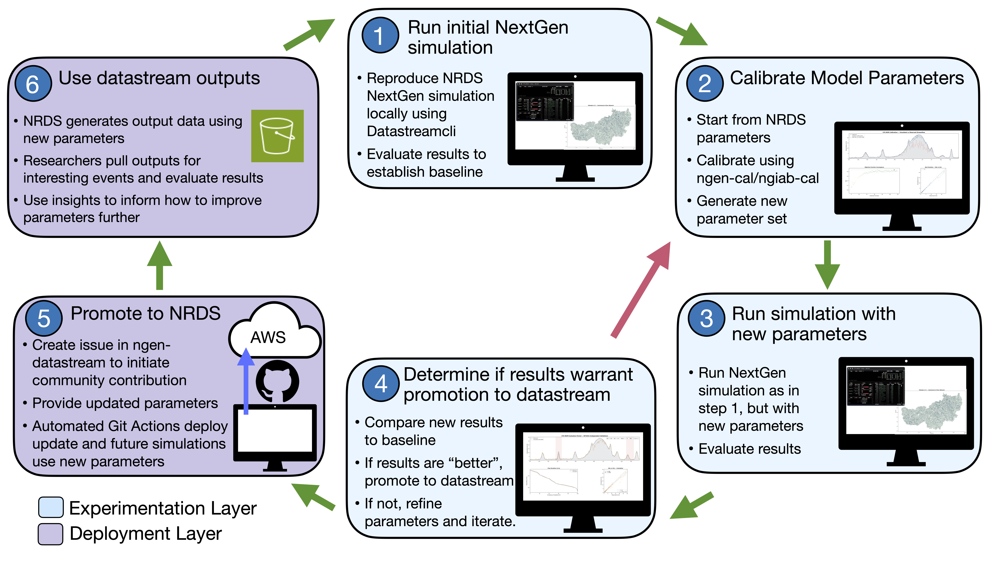

# Background: Why the NRDS Exists

Operational hydrologic forecasting systems such as the National Water Model ([Cosgrove et al., 2024](https://doi.org/10.1111/1752-1688.13184)) are tightly coupled. Model code, forcing pipelines, calibration procedures, and computational and civil infrastructure all interlock, so substantial updates arrive only with major version upgrades, each a multi-year effort. Research moves faster than that, and advances accumulate between releases faster than they can be absorbed.

Two distinct obstacles stand between a promising research result and an operational capability.

**The scientific obstacle.** A method that performs well in a study is likely not ready for operational deployment. Its skill has to hold across the full range of hydrologic regimes and seasons the operational spatial-temporal forecast space contains. Due to sparse observations, its parameters have to be estimated at scale rather than tuned per catchment. Its failure modes have to be characterized. Readying the method for operational deployment entails iterative improvement of the model algorithm and configuration. This process requires cutting-edge research and enduring scientific creativity.

**The infrastructural obstacle.** Running any method under operational conditions is substantial engineering: ingesting operational forcing data, executing on the operational cadence, managing the resulting data flows, and doing all of it reproducibly at continental scale. This work is largely identical from one method to the next and it has to be redone by every group that attempts deployment of an operational-like forecast system.

These two obstacles map onto the two layers described below. The experimentation layer is where the scientific work happens, with tooling that gives a researcher full control over domain, period, parameters, and configuration. The NRDS is the infrastructural layer, built once and shared, so that no individual group has to build it again.

A method deployed as an NRDS datastream is already expressed in NextGen ([Ogden et al., 2026](https://doi.org/10.1111/1752-1688.70089)), the framework planned for NWM4.0, already driven by operational forcing products, and already running on the operational cadence. Whether that reduction in technical distance translates into reduced operational-adoption latency is the hypothesis the system is designed to test.

> A manuscript describing the NRDS design, its deployed datastreams, and its first year of operation is currently in review. It is the reference for the system's architecture, performance, and motivation. A citation will be added here on publication.

---

## What a Datastream Is

A datastream is a versioned processing pipeline that transforms a defined set of inputs into a defined set of outputs on a fixed cadence. It is specified by five things:

- **Inputs**: what it consumes
- **Processing**: what it does
- **Outputs**: what it produces
- **Cadence**: how often it runs
- **Execution environment**: the versioned, containerized software it runs in

Several deployed datastreams perform hydrologic simulation through the NextGen Prototype, but the abstraction is general. A datastream is any computational workflow worth executing repeatedly, reproducibly, and at scale, from a full continental-scale forecasting configuration to a narrowly scoped processing job on a single region. Routing without hydrologic simulation, forcing preparation, and streamflow interpolation are all deployed datastreams today.

The execution specification is the sole unit of deployment, and the ones running today are in [ngen-datastream](https://github.com/CIROH-UA/ngen-datastream/tree/main/docs/nrds/DATASTREAMS.md). Adding a datastream requires no modification to any orchestration component.

---

## Two Layers to Address Two Obstacles

### The Experimentation Layer

**NGIAB ([Patel et al., 2025](https://doi.org/10.1016/j.envsoft.2025.106666)), the NGIAB Data Preprocessor, DataStreamCLI, and ngen-cal**, run on your own hardware or on community cloud infrastructure such as the CIROH Community NextGen Hub ([Nassar et al., 2026](https://doi.org/10.1016/j.envsoft.2026.107031)). The layer is represented by the Researcher steps (1-4) in the loop depicted below.

This is where research happens. You get:

- **Arbitrary domains.** The [NGIAB Data Preprocessor](https://github.com/CIROH-UA/NGIAB_data_preprocess) subsets the hydrofabric, including by USGS gage identifier, so a test watershed such as a CAMELS basin or your own study catchment is directly addressable.
- **Arbitrary periods.** The Data Preprocessor retrieves archived forcings like AORC so you can simulate a past flood event or construct a multi-decade retrospective for calibration. DataStreamCLI can be used to simulate in a forecast context by using operational NWM forcing products.
- **Calibration.** [ngen-cal](https://github.com/NOAA-OWP/ngen-cal), the NextGen calibration toolkit, is where parameter estimation happens. The NRDS initially deployed BMI configuration templates that originated from this toolkit.
- **Full control.** You are free to edit and use your own realizations, parameters, and configurations to conduct any simulations with an immense amount of public data. 

### The Deployment Layer

**The NRDS itself.** Scheduled, continental-scale, operational-cadence execution of configurations promoted from the experimentation layer. The layer is represented by the NRDS Engagement steps (5-6) in the loop depicted below.

This is where a method becomes a continuously running artifact. Outputs accumulate publicly and reproducibly on the operational cadence, retained for a period agreed upon when the datastream is deployed.

Once a researcher evaluates their method and finds it ready for deployment in the NRDS, they submit a contribution in the form of an issue to one of the NRDS related repositories. The internal development team then deploys the method via a pull request to ngen-datastream. 

---

## The NRDS–Research Loop

  

The two layers are connected by a cycle: develop and test at the experimentation layer, promote to deployment, accumulate public reproducible outputs, evaluate them as community science, refine, redeploy.

This loop is how the NRDS development team sees how this project can effectively facilitate the refinement of promising research methods into more operational-ready forecasting tools.

---

## What the NRDS Deliberately Does Not Do

The system's boundaries are as important as its capabilities, and each boundary is a place where community contribution matters.

**It does not calibrate.** Deployed BMI configuration files carry parameter values from hydrofabric-distributed defaults and [ngen-cal](https://github.com/NOAA-OWP/ngen-cal) configuration templates. Calibration happens with ngen-cal at the experimentation layer. This is why improved parameter sets are the highest-leverage contribution available: the system is running on defaults.

**It does not evaluate.** Skill evaluation is community scientific activity supported by the NRDS rather than performed by it. See [TEEHR](https://github.com/RTIInternational/teehr). Completion-rate and reliability metrics demonstrate infrastructural soundness rather than hydrologic skill, and the two should not be confused.

**It does not dynamically exchange streamflow across VPU boundaries.** VPUs execute independently. Boundaries largely coincide with hydrologic divides, and warm channel states at initialization reflect upstream contributions. Within a forecast horizon, however, inflows generated in an upstream VPU are not propagated downstream. Forecasts for mainstem reaches immediately downstream of a VPU boundary should be read with that in mind.

**It does not perform the science.** The NRDS provides infrastructure to execute community methods at scale, reproducibly, under operational-like conditions. Model development, calibration, evaluation, and interpretation remain with the research community. That division is a design commitment.

---

## Why the Architecture Is Composable

Datastreams are independent, independently versioned pipelines whose outputs can feed one another. Forcing preparation is its own datastream; simulation datastreams consume its output; downstream applications could consume theirs.

---

## Why Cost Efficiency Is a Scientific Concern

The NRDS runs on a finite cloud budget, which creates an inverse relationship between the cost of a method and the amount of science the system can support. The cheaper a method is to run, the larger the domain it can cover, the finer the cadence it can run at, the longer the record it can produce, and the more room remains for other datastreams alongside it.

This creates a direct incentive for the contributing scientist to optimize their processing code so that it can be deployed at a greater scale and yield greater scientific benefit.

---

## Next Step

[CONTRIBUTING.md](CONTRIBUTING.md) covers how to contribute: the two contribution paths, which issue template to use, and what to know before opening an issue.
