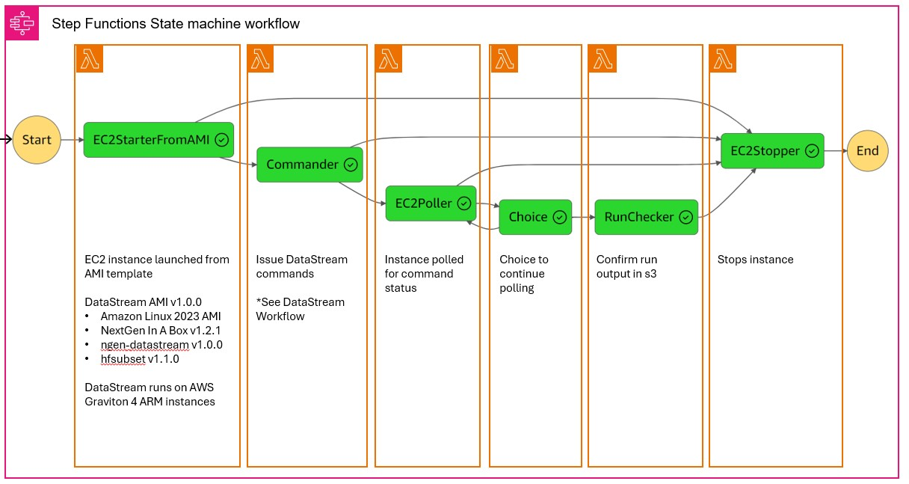

# AWS Architecture
This document provides a technical look at the AWS infrastructure that is created with the Terraform availble in `ngen-datastream`. A deep understanding of this document is not required for building the infrastructure and issuing executions, but it is helpful to know what it happening on the inside.

The AWS State Machine diagram

Each green box represents a distinct AWS Lambda Function that is responsible for a task such as spawning an instance from an Amazon Machine Image or issuing commands to an instance. Together these lambdas coordinate the task of creating a cloud based host to which a user can issue commands. 

Here's a rough idea of the workflow once a user submits an execution to the AWS statemachine.
1) User submits execution request at the cli via `aws stepfunctions start-execution`
2) AWS Lambda Function `EC2StarterFromAMI` spawns an instance from an AMI. This AMI must exist and be available within the region specified in the execution json. This function blocks until the instance is running and ready to accept commands. 
    * The instance spawned by `EC2StarterFromAMI` must do so starting from a template AMI. This is a user supplied field in the execution json, which allows the user to build from any AMI. This feature makes this state machine general purpose. The intended implementation is for NextGen executions (an example of that [here](https://github.com/CIROH-UA/ngen-datastream/edit/main/research_datastream/terraform/AWS_BASICS.md#1-aws-step-functions-state-machines)), however it is possible a user creates their own custom AMI for any sort of job.
3) AWS Lambda Function `Commander` issues the commands the user specifies in the execution json. If a command failure is encountered, the instance will be stopped and state machine execution will complete.
4) AWS Lambda Function `EC2Poller` will poll the instance for the status of the commands issued. If a command failure is encountered, the instance will be stopped and state machine execution will complete. This function blocks until the commands either fail or complete without error.
5) AWS Lambda Function `RunChecker` will check the existence of an s3 object. This ensures that the data written out by the instance actually exists.
6) AWS Lambda Function `EC2Stooper` will stop the spawned instance. Optionally, this lambda will also dismount the volume to avoid incurring storage charges. Note that the state machine may complete "successfully" while a command on the spawned instance fails. A State machine success means that the lambda functions did their job, which may be to handle an error in the command supplied by the user in the excecution json. Check the state machine console to watch the execution progress and to debug potential problems.
