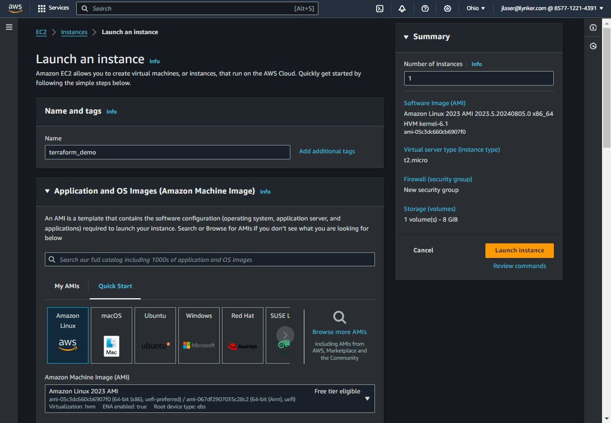
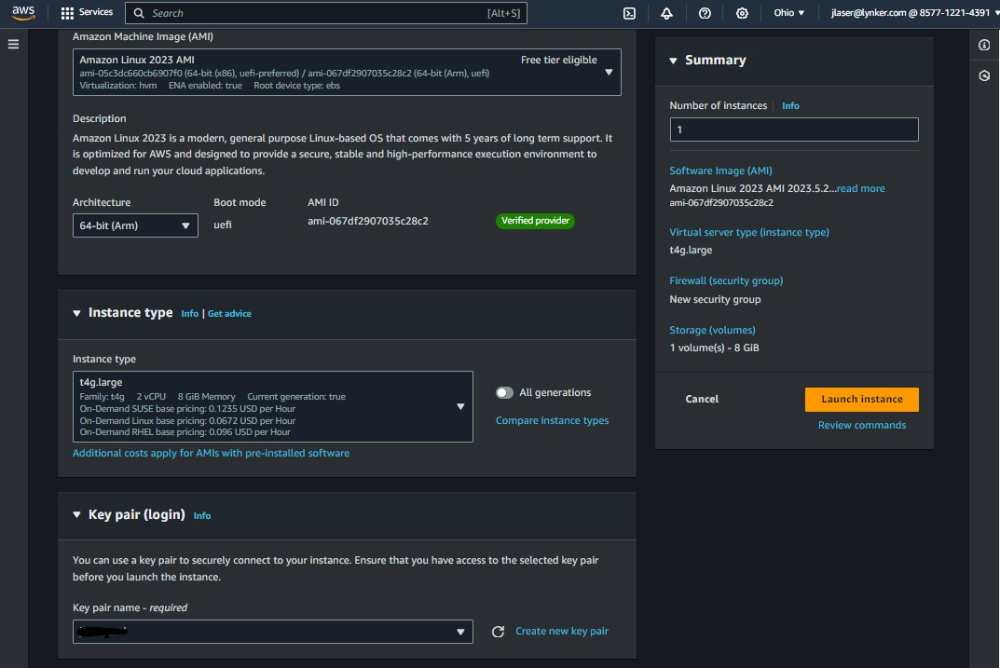
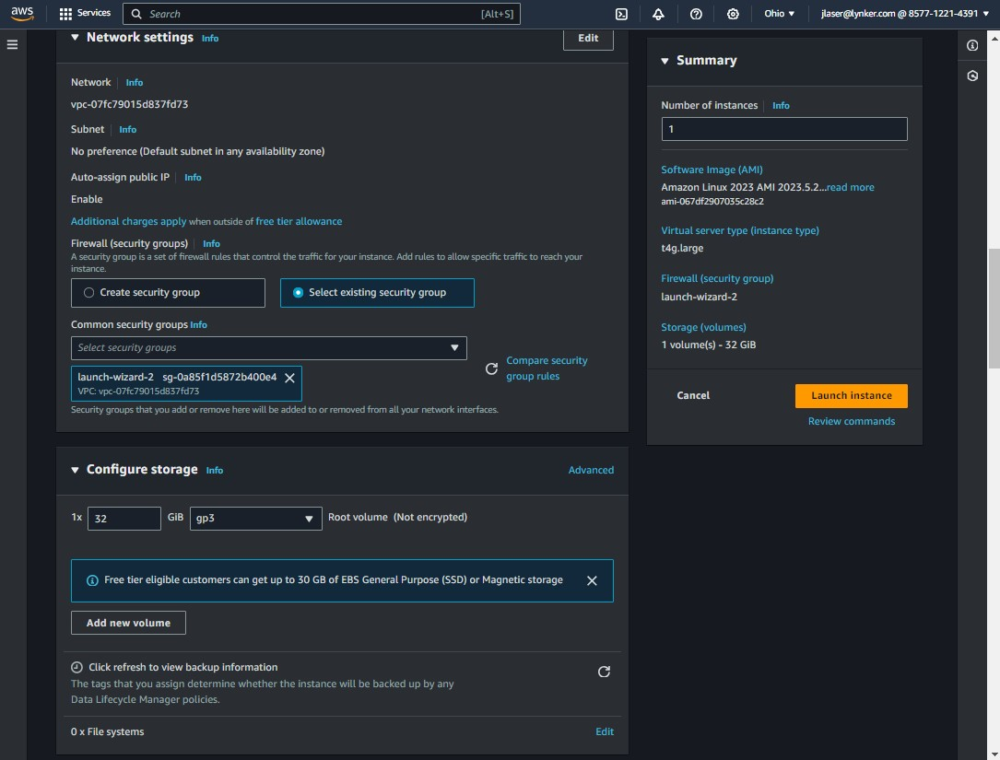
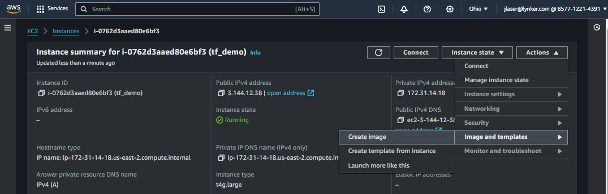
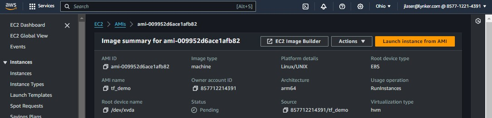

This document will step users through standing up the AWS State Machine and executing NextGen jobs via `ngen-datastream`. Make sure to have completed the [prerequsites](https://github.com/CIROH-UA/ngen-datastream/tree/main/terraform#prerequisites).

## Build the infrastructure
You can find that back in the [terraform README](https://github.com/CIROH-UA/ngen-datastream/tree/main/terraform#Building-AWS-State-Machine)

## Build an Amazon Machine Image
Before we can issue an execution, we must first have an [AMI](https://github.com/CIROH-UA/ngen-datastream/tree/main/terraform/AWS_BASICS.md#amazon-machine-images-amis) to spawn an instance from. To create an AMI, we will launch an instance from the template AWS Linux 2023 AMI and install ngen-datastream.

### Launch instance
Pick a region to launch your instance in, here it is `us-east-2`. Also pick a name, here `terraform_demo`. Select the Amazon Linux 2023 AMI as seen below.



Next, define the architecture. Here, we request an ARM based host. Note that the AMI will be architecture specific, so you can only spawn ARM typed ec2 instances from an ARM AMI. Here we select a `t4g.large` ARM instance with 2 vCPUs and 8 GiB of memory. Select the key you wish to use to ssh into the instance; create a new key if needed.



Lastly, define a security group to which the instance will belong. Typically a user has default security groups available, which should be fine to use. Also configure the volume size, here we will mount a 32 GiB drive. Launch the instance.



SSH into the instance by providing the path to the key pair file. Find the instance in the AWS console to retrieve the Public IPv4 DNS address. 
```
ssh -i <path_to_your_key> ec2-user@<Public_IPv4_DNS_address>
```

### Install ngen-datastream
First, install docker
```
sudo dnf install docker -y && sudo systemctl start docker && sudo usermod -aG docker ec2-user && sudo newgrp docker
```
This will set your user to `root`. Type `exit` to return back to `ec2-user`. Then type `exit` again to exit the ssh session. ssh back into the instance and check that the docker daemon in running properly with `docker run hello-world`.

Second, install required packages
```
curl -L -O https://s3.amazonaws.com/mountpoint-s3-release/latest/arm64/mount-s3.rpm && curl -L -O https://github.com/lynker-spatial/hfsubsetCLI/releases/download/v1.1.0/hfsubset-v1.1.0-linux_arm64.tar.gz && tar -xzvf hfsubset-v1.1.0-linux_arm64.tar.gz && sudo mv ./hfsubset /usr/bin/hfsubset && sudo dnf install ./mount-s3.rpm git pip pigz awscli python -y
```

Next, clone this repository
```
git clone https://github.com/CIROH-UA/ngen-datastream.git
```

At this point, the instance is in an appropriate state for `ngen-datastream` executions. If you would like to store the `ngen-datastream` docker images with the AMI as well, you can pull them with these commands
```
docker pull awiciroh/datastream:latest
docker pull awiciroh/forcingprocessor:latest
```
This is not requried, but will save on execution time at the expensive of AMI size.

### Create AMI from instance
Head back to the AWS console and find your instance and create an image from it. Note that this will shut down the instance and you will not be able to SSH into it during the image creation.



Hold on to the AMI ID.



## Execute a NextGen job
1) Create an execution json
```
cp ./executions/execution_template.json  ./executions/execution_test_1.json
```
2) Open this file up and let's fill in everything you'll need
```
vi ./executions/execution_test_1.json
```
3) Define the AMI ID. 
```
  "instance_parameters" :
  {
    "ImageId"            : "ami-###",
```
4) Define the desired instance type. Make sure the hardware architecture matches the AMI.
```
    "InstanceType"       : "t2g.xlarge",
```
5) Define the key that authenticates the user when SSH'ing into the instance. 
```
    "KeyName"            : "your_key.pem",
```
6) Define the security group. Make sure it allows for inbound traffic if you want to SSH.
```
    "SecurityGroupIds"   : ["sg-###"],
```
7) This must match `profile_name` in variables.tfvars
```
    "IamInstanceProfile" : {
        "Name" : "name-of-instance-profile"
        },
```
8) Name for the instance
```
    "TagSpecifications"   :[
      {
          "ResourceType": "instance",
          "Tags": [
              {
                  "Key"   : "Name",
                  "Value" : "whatever-name-you-want"
              }
          ]
      }
```
9) Define the disk size for the instance
```
    "BlockDeviceMappings":[
      {
          "DeviceName": "/dev/xvda",  
          "Ebs": {
              "VolumeSize": 64,
              "VolumeType": "gp2"  
          }
      }
    ]
```
10) Define the region. Make sure this matches the region the state machine exists in.
```
  "region"   : "us-east-2",
```
11) Provide the commands you want the instance to execute. Below is an example to create a directory, mount a bucket to the instance, and run a `ngen-datastream` execution that will copy the data directory to the bucket before terminating.
```
  "commands"  : [
    "runuser -l ec2-user -c 'mkdir -p /home/ec2-user/ngen-datastream/data/mount'",
    "runuser -l ec2-user -c 'mount-s3 ngen-datastream /home/ec2-user/ngen-datastream/data/mount'",
    "runuser -l ec2-user -c 'cd /home/ec2-user/ngen-datastream && ./scripts/stream.sh -s 202406100100 -e 202406100200 -g https://lynker-spatial.s3.amazonaws.com/hydrofabric/v20.1/gpkg/nextgen_09.gpkg -R ./configs/ngen/realization_sloth_nom_cfe_pet.json -S ./data/mount -o /test -n 4'"
  ],
```
12) The state machine will confirm a complete execution by checking for the existence of an s3 object. Set the bucket and object key to look for here. `ngen-datastream` will always create a `ngen-run.tar.gz` file that can be found at `s3://<bucket>/<prefix>/ngen-run.tar.gz`
```
  "bucket"   : "",
  "obj_key"  : ""
```
13) Finally, execute the state machine.
```
aws stepfunctions start-execution \
--state-machine-arn arn:aws:states:us-east-1:###:stateMachine:<sm_name> \
--name your-execution-name \
--input "file://$(pwd)/executions/execution_test_1.json" \
--region us-east-2
```